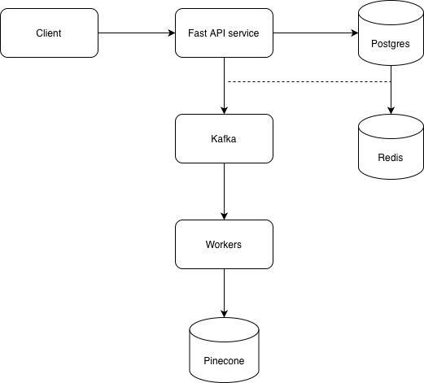

# Multi-Tenant Document Intelligence

A scalable document intelligence system with multi-tenant support, built with FastAPI, Kafka, PostgreSQL, and vector search capabilities.

## Features

- **Multi-Tenant Architecture**: Isolated tenant data and operations
- **Document Processing**: Upload, chunk, and embed documents
- **Vector Search**: Semantic search using embeddings (Gemini + Pinecone)
- **Event-Driven**: Kafka-based asynchronous processing
- **Rate Limiting**: Redis-based rate limiting per tenant
- **Monitoring**: Prometheus metrics and Grafana dashboards
- **RESTful API**: FastAPI with automatic documentation
- **Performance Optimized**: Concurrent processing, bulk operations, and database indexing

## Tech Stack

- **Backend**: FastAPI, Python 3.11+
- **Database**: PostgreSQL (with asyncpg)
- **Cache**: Redis
- **Message Queue**: Apache Kafka
- **Vector Database**: Pinecone
- **Embeddings**: Google Gemini API
- **Monitoring**: Prometheus + Grafana
- **Containerization**: Docker & Docker Compose

## Performance Features

- **Concurrent Embedding Generation**: Process multiple embeddings simultaneously
- **Bulk Database Operations**: Optimize inserts for chunks and jobs
- **Database Indexing**: Strategic indexes on frequently queried fields
- **Non-Blocking I/O**: All external API calls run in thread executors
- **Resource Caching**: Spacy models cached to avoid reloading
- **Optimized Queries**: COUNT queries and selective field loading

See [Performance Optimizations](docs/PERFORMANCE_OPTIMIZATIONS.md) for detailed information.

## Architecture Overview



## Quick Start with Docker

### Prerequisites

- Docker Desktop or Docker Engine
- Docker Compose v3.8+
- API keys for Gemini and Pinecone

### Setup

1. **Clone the repository**:
   ```bash
   git clone <repository-url>
   cd Multi-Tenant-Document-Intelligence
   ```

2. **Create environment file**:
   ```bash
   cd docker
   cp env.example .env
   ```

3. **Edit `.env` file** and add your API keys:
   ```env
   GEMINI_API_KEY=your_gemini_api_key
   PINECONE_API_KEY=your_pinecone_api_key
   PINECONE_INDEX_NAME=your_index_name
   ```

4. **Start all services**:
   ```bash
   make up
   # Or: docker-compose up -d --build
   ```

5. **Check service status**:
   ```bash
   make status
   # Or: docker-compose ps
   ```

6. **View logs**:
   ```bash
   make logs
   # Or: docker-compose logs -f
   ```

### Access the Application

- **API**: http://localhost:8000
- **API Docs**: http://localhost:8000/docs
- **Grafana**: http://localhost:3000 (admin/admin)
- **Prometheus**: http://localhost:9090

For detailed Docker setup instructions, see [DOCKER_SETUP.md](docs/DOCKER_SETUP.md)

## Development Setup (without Docker)

### Prerequisites

- Python 3.11+
- PostgreSQL 15+
- Redis 7+
- Apache Kafka 2.8+

### Installation

1. **Create virtual environment**:
   ```bash
   python -m venv venv
   source venv/bin/activate
   ```

2. **Install dependencies**:
   ```bash
   pip install -r requirements.txt
   ```

3. **Set up environment variables**:
   ```bash
   cp env.example .env
   # Edit .env with your configuration
   ```

4. **Start PostgreSQL and Redis** (using Docker or locally):
   ```bash
   docker-compose up -d db redis kafka zookeeper
   ```

5. **Run migrations**:
   ```bash
   alembic upgrade head
   ```

6. **Start the application**:
   ```bash
   uvicorn app.main:app --reload
   ```

7. **Start the worker** (in another terminal):
   ```bash
   python -m app.workers.v2.worker
   ```

## Project Structure

```
Multi-Tenant-Document-Intelligence/
├── app/
│   ├── api/              # API routes
│   ├── core/             # Core configuration and settings
│   ├── db/               # Database models and sessions
│   ├── services/         # Business logic services
│   ├── utils/            # Utility functions
│   ├── workers/          # Kafka workers
│   └── main.py           # FastAPI application
├── uploads/              # Uploaded documents
├── logs/                 # Application logs
├── docker/               # Docker Compose, dockerfile and .env configuration
├── Makefile              # Useful make commands
├── requirements.txt      # Python dependencies
└── alembic.ini           # Database migration config
```

## Makefile Commands

```bash
make help          # Show all available commands
make up            # Start all services
make down          # Stop all services
make restart       # Restart all services
make logs          # View logs
make logs-app      # View app logs only
make logs-worker   # View worker logs only
make migrate       # Run database migrations
make shell-app     # Access app container shell
make shell-db      # Access database shell
make clean         # Stop and remove everything
make rebuild       # Rebuild and restart
```

## API Endpoints

### Tenants

- `POST /api/v1/tenants` - Create a new tenant
- `GET /api/v1/tenants/{tenant_id}` - Get tenant details

### Documents

- `POST /api/v1/uploads` - Upload a document and ingestion 
- `GET /api/v1/uploads/get` - List documents for a tenant

### Search

- `POST /api/v1/search/semantic` - Semantic search across documents

### Health

- `GET /api/v1/health` - Health check
- `GET /metrics` - Prometheus metrics

## Monitoring

### Prometheus

Access Prometheus at http://localhost:9090

### Grafana

- URL: http://localhost:3000
- Username: `admin`
- Password: `admin`

Pre-configured dashboards:
- FastAPI application metrics
- Worker performance metrics
- Kafka consumer metrics

## Environment Variables

See `env.example` for all available environment variables:

- `DATABASE_URL` - PostgreSQL connection string
- `REDIS_URL` - Redis connection string
- `KAFKA_BROKER` - Kafka broker address
- `GEMINI_API_KEY` - Google Gemini API key (required)
- `PINECONE_API_KEY` - Pinecone API key (required)
- `PINECONE_INDEX_NAME` - Pinecone index name
- `SECRET_KEY` - JWT secret key
- `CHUNKING_STRATEGY` - Document chunking strategy

## Database Migrations

Run migrations with Alembic:

```bash
# Create a new migration
alembic revision --autogenerate -m "description"

# Apply migrations
alembic upgrade head

# Rollback one migration
alembic downgrade -1
```

With Docker:
```bash
make migrate
# Or: docker-compose exec app alembic upgrade head
```

## Troubleshooting

### Port Already in Use

If a port is already in use:
```bash
# Find and kill process
lsof -i :8000
kill -9 <PID>
```

### Database Connection Issues

Ensure PostgreSQL is running:
```bash
docker-compose logs db
```

### Kafka Connection Issues

Check Kafka status:
```bash
docker-compose logs kafka
docker-compose exec kafka kafka-topics --list --bootstrap-server localhost:9092
```

### Contributor
- [Jarviss77](https://github.com/Jarviss77/)